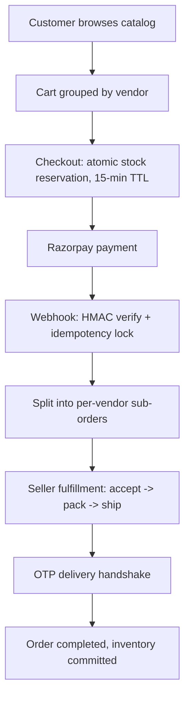

# MarketHub

**Multi-vendor e-commerce & inventory management platform** with atomic stock reservation, split-order fulfillment, and a cryptographic OTP delivery handshake.

[](https://github.com/Omiiii04/IITB-Hackathon/actions)
[](https://github.com/Omiiii04/IITB-Hackathon/actions)
[](LICENSE)


Originally built for IIT Bombay's hackathon (Problem Statement 3: Multi-Vendor E-Commerce & Inventory Management).

## Contents

- [Overview](#overview)
- [Features](#features)
- [Architecture](#architecture)
- [Tech Stack](#tech-stack)
- [Getting Started](#getting-started)
- [Testing](#testing)
- [Demo](#demo)
- [Project Structure](#project-structure)
- [Deployment](#deployment)
- [Contributing](#contributing)
- [License](#license)

## Overview

MarketHub is a full-stack, multi-tenant marketplace. Independent vendors sell through their own storefronts while sharing one customer-facing catalog, cart, and checkout. A single customer payment splits atomically into per-vendor sub-orders, each tracked through its own fulfillment pipeline.

## Features

- **Atomic stock reservation** — transactional `stock - reserved >= requested` checks with a 15-minute reservation TTL, preventing overselling under concurrent checkout.
- **Split multi-vendor orders** — one payment fractures into vendor-isolated sub-orders, each independently accepted, packed, and shipped.
- **Cryptographic OTP delivery handshake** — a per-sub-order OTP verifies physical handoff before an order is marked complete.
- **Idempotent payments** — timing-safe HMAC-SHA256 Razorpay webhook verification with event-level locking against duplicate processing.
- **AI-assisted listings** — Gemini 2.0 Flash generates SEO-aware product descriptions from a title.
- **Role-based portals** — storefront, seller, and admin experiences, with store-approval governance and category taxonomy management.

## Architecture



## Tech Stack

| Layer | Technology |
|---|---|
| Framework | Next.js 15 (App Router), React 19, TypeScript |
| Styling | Tailwind CSS v4 |
| Database | PostgreSQL + Prisma 6 |
| Auth | JWT (access/refresh) + Google OAuth 2.0, Argon2id password hashing |
| Payments | Razorpay |
| Storage | Cloudinary |
| AI | Google Gemini 2.0 Flash |
| Testing | Vitest (unit/integration), Playwright (e2e) |
| Infra | Docker, Railway |

## Getting Started

### Prerequisites
- Node.js ≥ 20
- Docker & Docker Compose

### Setup
```bash
git clone https://github.com/Omiiii04/IITB-Hackathon.git
cd IITB-Hackathon
npm ci
cp .env.example .env
```
Fill in `.env` — see `.env.example` for the full list (database, JWT secrets, Google OAuth, Razorpay, Cloudinary, Gemini).

### Run
```bash
npm run docker:db   # start Postgres
npx prisma generate
npm run db:seed     # demo catalog, accounts, orders
npm run dev
```
Open [http://localhost:3000](http://localhost:3000). Or run the full stack in Docker: `npm run docker:up`.

## Testing

```bash
npm test          # unit + integration (Vitest)
npm run test:e2e  # end-to-end (Playwright)
npx tsc --noEmit  # type check
npm run build     # production build
```

## Demo

<details>
<summary>Seeded accounts (password: <code>Password123!</code> for all)</summary>

| Role | Email | Notes |
|---|---|---|
| Admin | `admin@markethub.com` | Store approvals, category taxonomy, platform analytics |
| Seller — Aura Apparel | `seller1@markethub.com` | Approved store, variant matrix, coupons |
| Seller — TechNova | `seller2@markethub.com` | Approved store, CSV bulk inventory upload |
| Seller — GreenLeaf | `seller3@markethub.com` | Pending approval (demonstrates admin governance) |
| Customer | `customer@markethub.com` | Multi-vendor cart, Razorpay checkout |
| Delivery agent | `delivery@markethub.com` | OTP delivery handshake |

</details>

A live deployment was previously hosted at `iitb.omiiii.me`; it's currently suspended — run locally via the steps above.

## Project Structure

```
src/
├── app/          # Next.js routes (storefront, seller, admin, auth, API)
├── modules/      # Domain logic: cart, checkout, orders, payments, inventory, ai, ...
├── components/   # Shared UI components
├── lib/          # Cross-cutting utilities (db, auth, validation)
├── hooks/        # React hooks
└── types/        # Shared TypeScript types

prisma/           # Schema, migrations, seed script
tests/            # Unit, integration, and e2e tests
```

## Deployment

Containerized via `Dockerfile` / `docker-compose.yml`. `railway.json` configures a Railway deployment (Dockerfile build, health check at `/api/health`).

## Contributing

Issues and PRs are welcome. Fork the repo, create a branch, and open a PR — run `npm test` and `npx tsc --noEmit` before submitting.

## License

[MIT](LICENSE) © 2026 Om Apar
