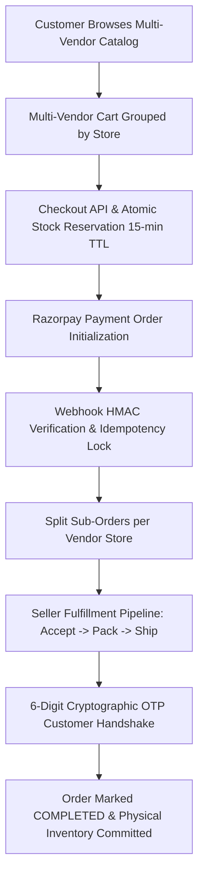

# MarketHub — Smart Multi-Vendor E-Commerce Platform
> **Problem Statement 3**: Multi-Vendor E-Commerce & Inventory Management Platform with Atomic Stock Reservation, Split Order Architecture, and Cryptographic OTP Delivery Handshake.

[](https://github.com/Omiiii04/IITB-Hackathon/actions)
[](https://github.com/Omiiii04/IITB-Hackathon/actions)

---

## 🌐 Live Production Deployment

- **Live Application URL**: [https://iitb.omiiii.me](https://iitb.omiiii.me)
- **API Diagnostics & Health Check**: [https://iitb.omiiii.me/api/health](https://iitb.omiiii.me/api/health)

---

## 🔑 Demo Accounts & Credentials Cheat-Sheet

All demo accounts are pre-seeded in PostgreSQL with Argon2id encrypted passwords:  
**Standard Password for All Accounts:** `Password123!`

| Role | Email | Password | Primary Scope / Capabilities |
| :--- | :--- | :--- | :--- |
| 🛡️ **Platform Admin** | `admin@markethub.com` | `Password123!` | Store approvals, category tree taxonomy, user management & GMV metrics |
| 🏬 **Seller 1 (Aura Apparel)** | `seller1@markethub.com` | `Password123!` | Approved store, streetwear apparel, variant matrix editor, coupons & order fulfillment |
| ⚡ **Seller 2 (TechNova)** | `seller2@markethub.com` | `Password123!` | Approved store, electronics & audio gear, CSV bulk inventory upload |
| 🌿 **Seller 3 (GreenLeaf)** | `seller3@markethub.com` | `Password123!` | Pending store approval (demonstrates Admin approval governance) |
| 🛒 **Customer** | `customer@markethub.com` | `Password123!` | Multi-vendor cart, saved addresses, Razorpay checkout & split order tracking |
| 🚚 **Delivery Agent** | `delivery@markethub.com` | `Password123!` | OTP delivery handshake verification |

---

## 🚀 Key Architectural Highlights



1. **Atomic Stock Reservation Engine**:
   - Verifies `(stock - reservedStock >= requestedQuantity)` within isolated database transactions.
   - Holds stock during checkout with an automatic 15-minute expiration window to prevent overselling and inventory lockouts.
2. **Multi-Vendor Cart & Sub-Order Splitting**:
   - Single customer payment automatically fractures into vendor-isolated sub-orders.
   - Each vendor independently accepts, packs, ships, and tracks their items.
3. **Cryptographic OTP Delivery Handshake**:
   - A unique 6-digit OTP is generated per sub-order upon transition to `OUT_FOR_DELIVERY`.
   - The seller/courier must verify the customer's OTP to finalize delivery.
4. **Idempotent Razorpay Payment Pipeline**:
   - Timing-safe HMAC-SHA256 signature verification (`crypto.timingSafeEqual`).
   - `ProcessedEvent` table locking guarantees webhook retries never duplicate transactions.
5. **Google Gemini 2.0 Flash AI Integration**:
   - Context-aware marketing copy and SEO description generator for sellers with customizable voice and tone settings.
6. **Enterprise Design System**:
   - Built on Tailwind CSS v4, dark glassmorphism, responsive data charts, and zero placeholder content.

---

## 🎯 Step-by-Step Judging Demo Walkthrough

### Flow 1: Customer Multi-Vendor Checkout & Payment
1. Open [https://iitb.omiiii.me](https://iitb.omiiii.me).
2. Log in as `customer@markethub.com` / `Password123!`.
3. Add items from **Aura Apparel** (Hoodie) and **TechNova** (Headphones) to your cart.
4. Open the Cart Drawer to see items automatically grouped by store.
5. Proceed to Checkout, apply coupon `WELCOME10`, select the saved Mumbai address, and click **Pay with Razorpay**.

### Flow 2: Seller Order Fulfillment & OTP Handshake
1. Log in as `seller1@markethub.com` / `Password123!`.
2. Navigate to **Seller Portal → Orders** (`/seller/orders`).
3. Advance the order: **Accept Order** → **Mark Packed** → **Mark Shipped** → **Mark Out for Delivery**.
4. When out for delivery, click **Confirm Delivery (OTP)** and enter the customer's 6-digit delivery OTP code (`492019`) to complete fulfillment.

### Flow 3: AI Product Description Generator
1. In Seller Portal, go to **Products → Add Product** (`/seller/products/new`).
2. Type a title (e.g., *"Ultra-Comfort Bamboo Fiber Lounge Pants"*).
3. Click **Generate Description with AI** to invoke Gemini 2.0 Flash and apply the generated copy directly.

### Flow 4: Admin Store Governance & Category Management
1. Log in as `admin@markethub.com` / `Password123!`.
2. Go to **Admin Console → Store Approvals** (`/admin/stores`) to review and approve **GreenLeaf Organics**.
3. Go to **Category Taxonomy** (`/admin/categories`) to manage root and sub-category hierarchies.
4. View platform GMV and revenue metrics in **Admin Analytics** (`/admin/dashboard`).

---

## 🛠️ Local Development & Quick Start

### 1. Prerequisites
- Node.js >= 20.x
- Docker & Docker Compose

### 2. Setup
```bash
git clone https://github.com/Omiiii04/IITB-Hackathon.git
cd IITB-Hackathon
npm ci
cp .env.example .env
```

### 3. Database Seeding & Development
```bash
# Generate Prisma client
npx prisma generate

# Seed demo catalog, accounts, and historical orders
npm run db:seed

# Run local dev server
npm run dev
```
Open [http://localhost:3000](http://localhost:3000) in your browser.

---

## 🧪 Testing & Quality Assurance

```bash
# Run all 137 unit & integration tests
npm test

# Run strict TypeScript type verification
npx tsc --noEmit

# Run production build verification
npm run build
```

---

## 📜 License
MIT License — Copyright (c) 2026 Om Apar & Team.
